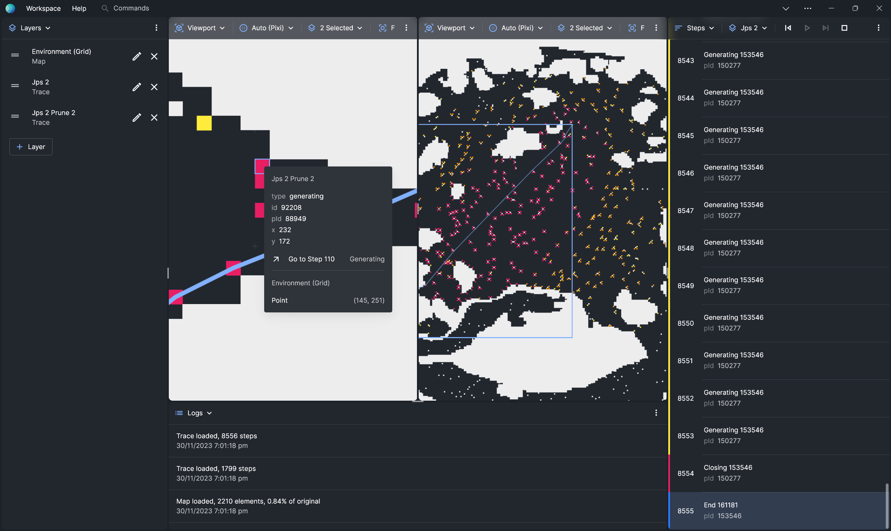

# Overview

**Visualiser** is a visualiser and debugger for spatially-embedded algorithms, especially pathfinding search.

Understanding how algorithms work can be hard. Luckily, pathfinding problems are often occur in have a spatial environment &mdash; navigating through roads, corridors, terrain etc. So, it's natural to reason about them visually. For these problems, rather than staring at `cout`/`print` logs or stepping through the code, it would make more sense to see them run in the context their respective environments.

What's more, Visualiser isn't just for pathfinding search. Visualiser is designed to visualise any sort of decision-making over a 2D or 3D space.

## What Can I Use Visualiser For?

### Insights

[TODO]

### Post-hoc Analysis

[TODO]

### Demonstrations

Creating visualisations are the best way to get your point across.

## What's So Cool About Visualiser?

### Declarative

Rather than writing your own visualiser, declaratively visualise your pathfinding search by creating _search traces_, YAML files that describe what happened during your algorithm, and how you want them to be drawn.

### Robust

[TODO]

### Extensible

[TODO]

## When Shouldn't I Use Visualiser?

### Not a Replacement for a Traditional Debugger

[TODO]

### Not For Plotting Graphs

[TODO]

:::warning

This site is under construction. Content may be inaccurate or missing.

:::
