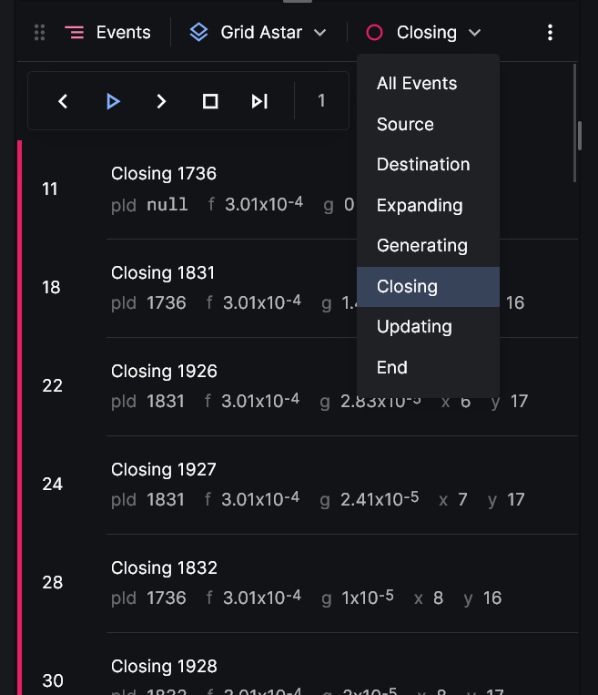
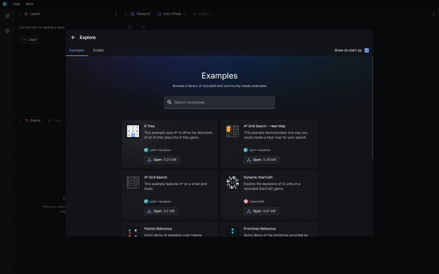
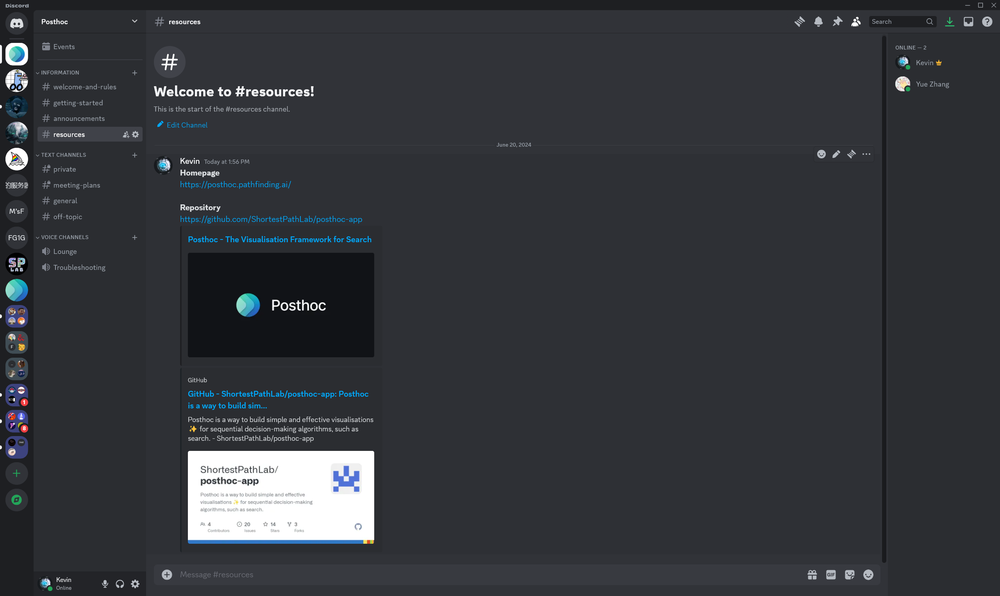

# Overview

**Posthoc** is a way to build quick-and-dirty visualisations ✨ for sequential decision-making algorithms, such as search algorithms 🚀.

It's easy to get started.

1. Print logs as [search traces](./3-search-trace)
2. Load those into the [Posthoc visualiser](./2-visualiser)
3. Voila!

[Search trace](./3-search-trace) is log-like YAML format that describes what happened during your algorithm, and how you want to visualise it. If you're generating logs already, we invite you to convert them to search traces. Then, [Posthoc](./2-visualiser) is a comprehensive, no-install visualiser that helps you interpret and analyse search traces.

## Find and fix problems

### Interrogate decisions

Play back, step-through, and inspect the decisions of your algorithm. See your algorithm as a decision tree by annotating your log with `id` and `pId` properties, or view it in context by including declarative rendering instructions in your trace.

### Use built-in debugging tools

Pinpoint when an invariant is violated, where a point of interest is, or where things go wrong, during algorithm execution. Do so by setting regular breakpoints or breakpoint expressions.

### Compare with a baseline

Identify where your algorithm has deviated from a known good baseline by comparing traces side-by-side or superimposed.

## Collaborate and share

### Discuss ideas with your team

Present your ideas to your team and problem-solve together.

### Help students learn

Walk through algorithms and techniques visually with students.

### Share your work

Let the world discover your work.

## Why we built Posthoc

We're a team of optimisation researchers at Monash University.

We built Posthoc because, so often, we want visualise our algorithms so we can better understand them, but equally as often we're intimidated by cost-benefit ratio of employing them in our workflows.

Building visualisations is a lot of effort; we want to focus on writing and perfecting our algorithm, not coding up visualisers. So when our algorithms don't behave as expected, we'll tend to troubleshoot via debuggers, logs, and assertions.

Posthoc adds visualisation to our problem-solving toolkit 🛠️.

When problems occur in a spatial environment &mdash; navigating through roads, corridors, terrain etc &mdash; it's just natural to reason about them visually. Posthoc lets us create quick-and-dirty visualisations to leverage intuition, debug problems, draw insights, and collaborate with each other.

:::warning

This site is under construction. Content may be inaccurate or missing.

:::
