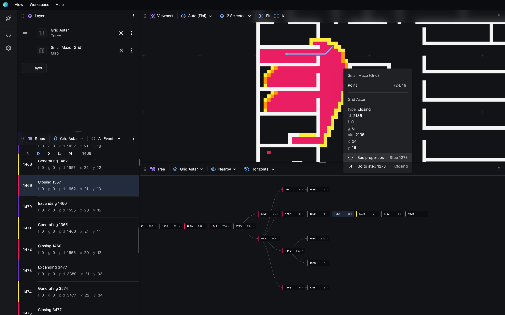
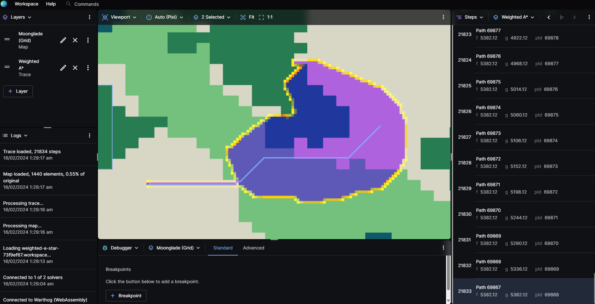
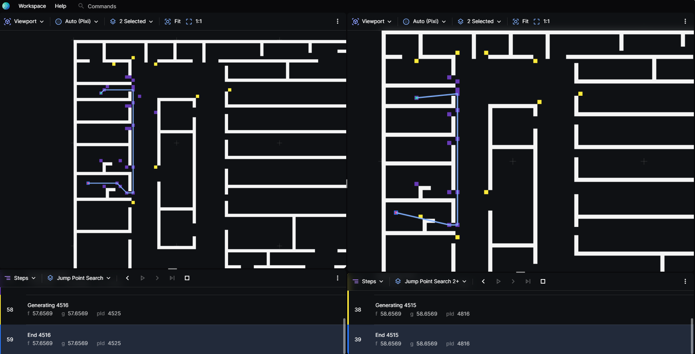
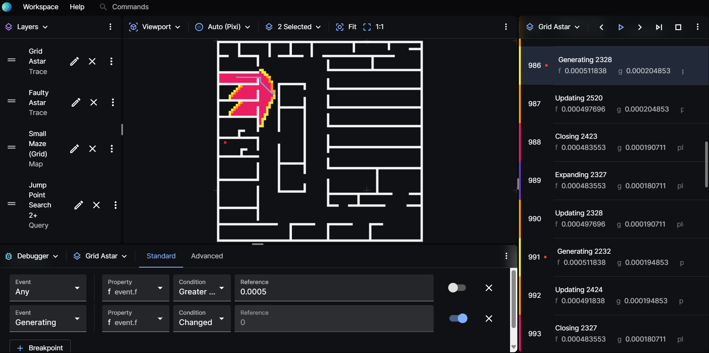
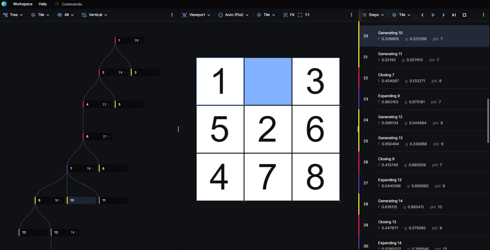

# Overview

**Posthoc** is a visualiser and debugger for spatially-embedded algorithms, especially pathfinding search.

Understanding how algorithms work can be hard. Luckily, pathfinding problems are often occur in have a spatial environment &mdash; navigating through roads, corridors, terrain etc. So, it's natural to reason about them visually. For these problems, rather than staring at `cout`/`print` logs or stepping through the code, it would make more sense to see them run in the context their respective environments.

What's more, Posthoc isn't just for pathfinding search. Posthoc is designed to visualise any sort of decision-making over a 2D or 3D space.

## What Can I Use Posthoc For?

### Educational

The Posthoc could be use as an learning tool in for learners' understanding of complex algorithms by providing a conducive environment for visualization. Consider the example of the weighted [A\* search](https://en.wikipedia.org/wiki/A*_search_algorithm) problem. Students often find it challenging to conceptualize how various weights assigned to different grid cells or walkable paths can influence the algorithm's decision-making process. The Posthoc bridges this gap, enabling learners to visually comprehend the impact of these weights on the algorithm's pathfinding capabilities.

In the illustration provided, the map is designed to mimic a video game environment, depicting a desert interspersed with patches of forest. The intensity of the green color indicates the weight of the walkable paths, with darker shades representing heavier weights. Through this visualization, it becomes evident how the A\* algorithm strategically selects a path from the source to the target. It does so by navigating through areas with the least amount of green, effectively avoiding paths with heavier weights to find the shortest and most efficient route. This visual demonstration not only clarifies the concept of weighted pathfinding but also showcases the algorithm's adeptness at incorporating path weights into its calculations, leading to an optimized solution.

### Algorithm Comparison

The Posthoc is able to visualise more than one trace at a time which enables users to be able to compare algorithms side by side which eases the users to see the difference between 2 or more algorithms or solutions.

In the illustration provided, we are able to see that Jump Point Search or JPS (left) for short is expands on more nodes compared to a newer version of it, JPS2+ (right).

### Debugging Pathfinding Issues

The Posthoc is able to set breakpoints and even allows users to code one within the visualiser! This simplifies identifying and solving problems in algorithm logic or execution. By visually representing each step an algorithm takes, learners can quickly pinpoint where things go wrong or see how an algorithm progresses.

In the illustration provided, using the built-in debugger, users are able to set breakpoints on certain conditions, there is even an advance option where it could be useful when the provided breakpoints scenarios does not cover the needs of our users.

### Visualising Decisions

The Posthoc has a built-in functionality which converts a trace into a decision tree!

In the illustration provided, using the Tree panel, the visualiser is able to visualise the decisions made by the algorithm.

Creating visualisations are the best way to get your point across.

## What's So Cool About Posthoc?

### Declarative

Rather than writing your own visualiser, declaratively visualise your pathfinding search by creating _search traces_, YAML files that describe what happened during your algorithm, and how you want them to be drawn.

### Robust

[TODO]

### Extensible

[TODO]

## When Shouldn't I Use Posthoc?

### Not a Replacement for a Traditional Debugger

[TODO]

### Not For Plotting Graphs

[TODO]

:::warning

This site is under construction. Content may be inaccurate or missing.

:::
