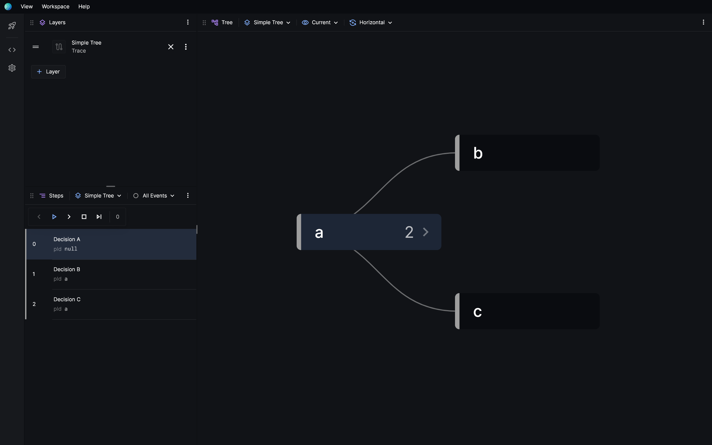
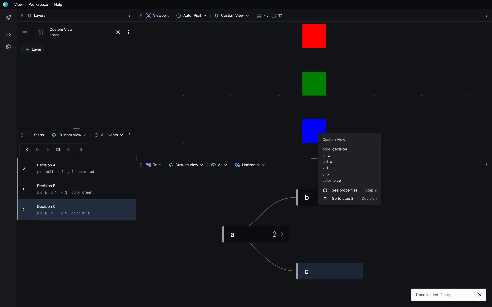
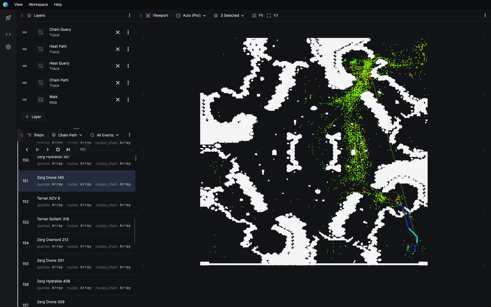
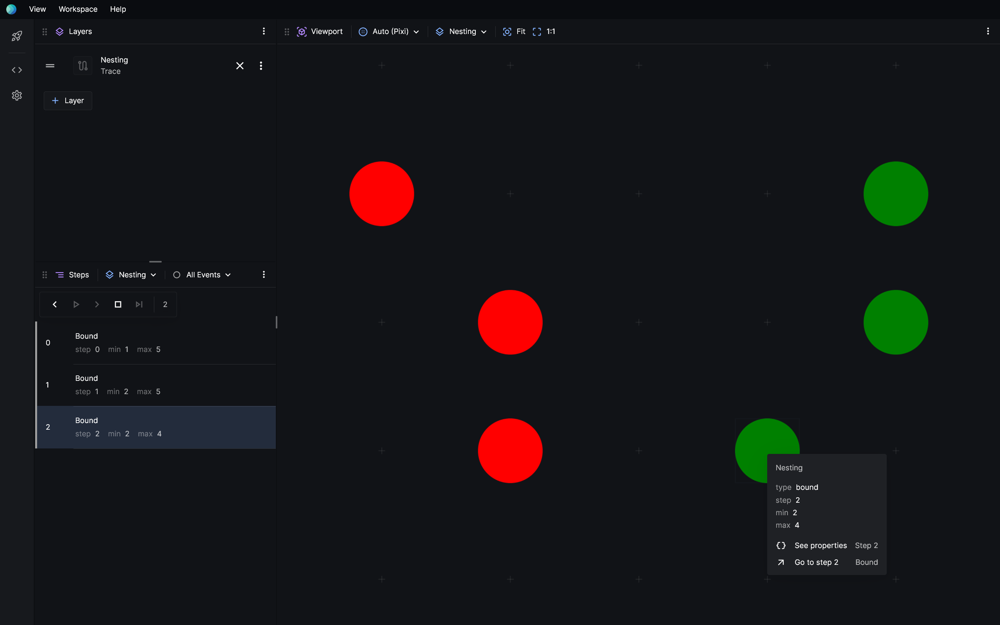
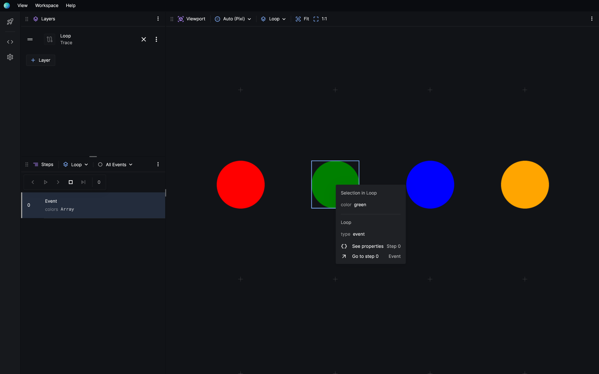
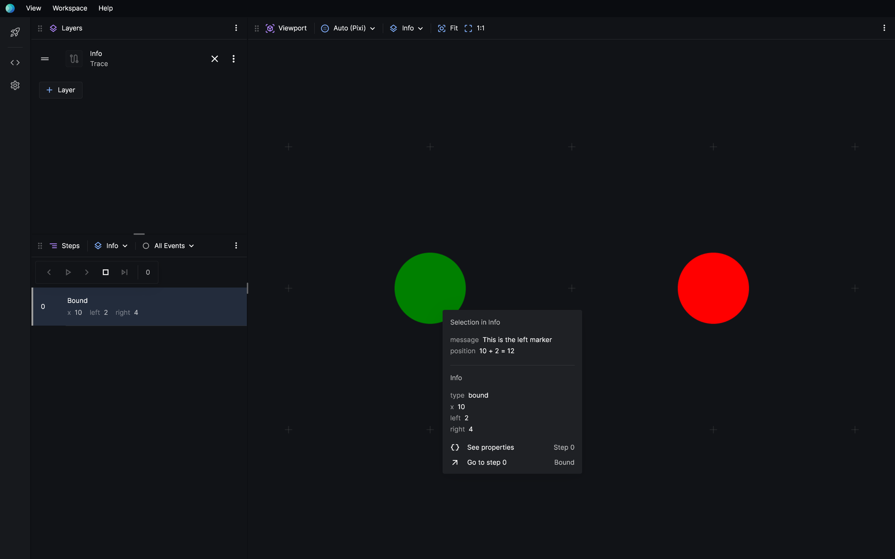

# Search trace

The search trace is a YAML log of your algorithm's decisions. What, and how much, you want to log is up to you. Here are some ideas.

<figure>
  ```yaml title="single-agent-search.trace.yaml"
  events:
    - { type: expand, id: 0, f: 0, g: 0 }
    - { type: generate, id: 1, pId: 0, f: 1, g: 1 }
    - { type: close, id: 0, f: 0, g: 0 }
  ```
  <figcaption>Generic search events</figcaption>
</figure>

<figure>
  ```yaml title="agent-moves.trace.yaml"
  events:
    - { type: move, agent: 47, id: 0, x: 0, y: 0 }
    - { type: move, agent: 18, id: 0, pId: 0, x: 5, y: 2 }
  ```
  <figcaption>Multi-agent plan execution</figcaption>
</figure>

<figure>
  ```yaml title="rayscan.trace.yaml"
  events:
    - { type: raycast, id: 1, x: 1, y: 2, rayX: 3, rayY: 4 }
    - { type: raycast, id: 1, x: 1, y: 2, rayX: 1, rayY: 4 }
    - { type: expand, id: 2, x: 3, y: 4 }
  ```
  <figcaption>Algorithm-specific events</figcaption>
</figure>

Since YAML is a superset of JSON, your traces can be in JSON too.

<figure>
  ```yaml title="single-agent-search.trace.json"
  {
    "events": [
      { "type": "expand", "id": 0, "f": 0, "g": 0 },
      { "type": "generate", "id": 1, "pId": 0, "f": 1, "g": 1 },
      { "type": "close", "id": 0, "f": 0, "g": 0 }
    ]
  }
  ```
  <figcaption>Generic search events (JSON)</figcaption>
</figure>

Search traces should have the extensions `.trace.yaml` or `.trace.json`.

## Decision tree

View your sequential decision-making processes as a tree or directed graph. Just provide `id` and `pId`(parent ID) properties in your log.

```yaml title="simple-tree.trace.yaml"
events:
  - { type: decision, id: a, pId: null }
  - { type: decision, id: b, pId: a }
  - { type: decision, id: c, pId: a }
```

The `type` property is optional, but should be a descriptive name of the kind of event that was logged.



## Custom views

Give your search trace a custom visual representation by adding a `views` section to it.

```yaml {1-8} title="custom-view.trace.yaml"
views:
  main:
    - $: rect # Show a rectangle...
      x: ${{ $.x }} # at this coordinate...
      y: ${{ $.y }} # at this coordinate...
      width: 1
      height: 1
      fill: ${{ theme.foreground }} # with this color 🎨
events:
  - { type: decision, id: a, x: 1, y: 1, pId: null }
  - { type: decision, id: b, x: 1, y: 3, pId: a }
  - { type: decision, id: c, x: 1, y: 5, pId: a }
```

The `main` view acts as the entry-point, and `rect` is a primitive provided by the built-in 2D renderer.



It's that easy!

Custom views get you quickly going to creating something useful, but its also a language that is powerful enough to let you express complex visualisations.



See the [2D renderer API reference](category/renderer) for a list of primitives provided by the built-in renderer.

## Nested views

Nesting allows you to create copies of some element without having to repeat yourself.

```yaml title="nesting.trace.yaml
views:
  // highlight-next-line
  marker: # A marker is defined here, which just draws a circle
    - $: circle
      fill: ${{ $.color }}
      radius: 0.25
      x: ${{ $.x }}
      y: ${{ $.step }}
  main:
    // highlight-next-line
    - $: marker # Render a red marker
      color: red
      x: ${{ $.min }}
    // highlight-next-line
    - $: marker # Render a green marker
      color: green
      x: ${{ $.max }}

events:
  - { type: bound, step: 0, min: 1, max: 5 }
  - { type: bound, step: 1, min: 2, max: 5 }
  - { type: bound, step: 2, min: 2, max: 4 }
```

Nest views by referencing other views with the `$` property. You can also pass properties to them, which is accessible via the `$` object in expressions.



## Property expressions

You can write expressions inside `${{  }}` brackets to reference event information or values passed from a parent view.

```yaml title="expression.trace.yaml
views:
  main:
    - $: rect
      width: 1
      height: 1
      // highlight-next-line
      fill: ${{ $.color }}
      $info:
        // highlight-next-line
        greeting: This rectangle is ${{ $.color }}

events:
  - { type: event, color: orange }
```

If a property is a single expression, the property's value and type is taken from the result of the expression. But, if the property contains multiple expressions, or if there's text around the expressions, it becomes a concatenated string instead.

See the [search trace API reference](api/search-trace) for a list of properties available in expressions.

## Special properties

### `clear`

Control when elements should be cleared.

| Value             | Example          | Description                                                                |
| ----------------- | ---------------- | -------------------------------------------------------------------------- |
| `false` (default) | `clear: false`   | Elements will remain once drawn.                                           |
| `true`            | `clear: true`    | Elements will clear immediately after the step they're drawn.              |
| `string`          | `clear: closing` | Clear once the event of a particular type (e.g. `closing`) is encountered. |

```yaml title="clear.trace.yaml"
views:
  main:
    - $: circle
      x: ${{ $.step }}
      y: 1
      radius: 0.25
      fill: ${{ colors.blue }}
      // highlight-next-line
      clear: close
events:
  - { type: open, id: 1 }
  - { type: generate, id: 1 }
  - { type: close, id: 1, message: Open and close events should be cleared }
```

### `$for`

Repeat a view based on a value.

```yaml {10-14} title="loop.trace.yaml"
views:
  main:
    - $: circle
      x: ${{ $.i }}
      y: 1
      radius: 0.25
      fill: ${{ $.colors[$.i] }}
      $info:
        color: ${{ $.colors[$.i] }}
      $for:
        $let: i # Optional, default `i`
        $from: 0 # Optional, default 0
        $step: 1 # Optional, default 1
        $to: ${{ $.colors.length }} # Required, number
events:
  - { type: event, colors: [red, green, blue, orange] }
```



### `$if`

Conditionally render a view.

```yaml title="if.trace.yaml"
views:
  main:
    - $: circle
      radius: 1
      x: 1
      y: 1
      fill: red
      // highlight-next-line
      $if: ${{ $.direction == 'left' }}
    - $: rect
      width: 1
      height: 1
      x: 1
      y: 1
      fill: red
      // highlight-next-line
      $if: ${{ $.direction == 'right' }}
events:
  - { type: event, direction: left }
  - { type: event, direction: right }
```

### `$info`

By default, clicking on elements in the viewport will show you info about the event that rendered it. However, you can define information that will only be shown when a specific part of the event was clicked.

```yaml {8-11,17-20} title="info.trace.yaml
views:
  main:
    - $: circle
      fill: green
      radius: 0.25
      x: ${{ $.x + $.l }}
      y: 0
      $info:
        message: This is the left marker
        position: ${{ $.x }} + ${{ $.l }} = ${{ $.x + $.l }}
    - $: circle
      fill: red
      radius: 0.25
      x: ${{ $.x + $.r }}
      y: 0
      $info:
        message: This is the right marker
        position: ${{ $.x }} + ${{ $.r }} = ${{ $.x + $.r }}
events:
  - { type: bound, x: 10, l: 2, r: 4 }
```



## API

The search trace API defines how you can write and structure your search trace. [See the search trace API](api/search-trace).

The renderer specifies what primitives are available and how you can use them. For the built-in renderer, see the [2D renderer API here](category/renderer).

Check out the [YAML 1.2.2 documentation](https://yaml.org/spec/1.2.2/) for all the ways you can write YAML.
