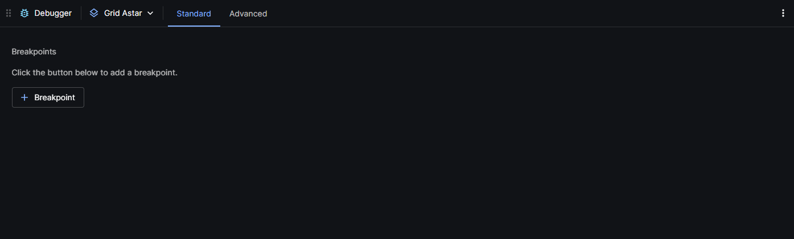
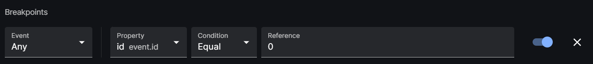
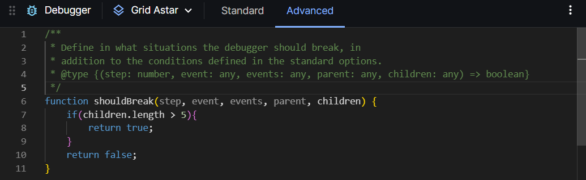
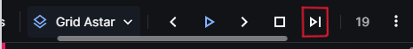

# Debugger Panel

Visualiser's Debugger panel is able to set breakpoints which stops the search trace or query at a specified condition.

## Adding a Breakpoint
- click on the + Breakpoint button, this gives you a new breakpoint like below.

- Event dropdown: This filters the events based on the event types.
- Property: The value that is being compared with.
- Condition: The condition for comparison, (changed mean that the value have changed compared to the previous value)
- Reference: Being the reference value for the comparison.
- Swtich: To indicate whether a breakpoint is active.

A demonstration [video](https://youtu.be/1iRMrrw9Dl0) shows on how to set a standart breakpoint and stepping thhrough the breakpoints

## Adding an Advance breakpoint
- Go on the Advanced tab.
- Within this tab is a function snippet where the parameters can be used to make a customised breakpoint.

- A use case would be using an if statement and return true for a certain condtion of a breakpoint.
- For further trying and error within this advanced breakpoint editor, use print statements (console.log) to print values of the parameters, the output of these print statements can be seen in teh web console (Inspect the web).

A demonstration [video](https://youtu.be/Pe50r0x4xFk) shows a use case for the advanced breakpoint editor.

## Stepping through the breakpoints
- To step through the trace and jump to the next breakpoint, make a new steps panel by splitting an existing panel, 
- Scroll the header of the panel sideways to reveal the jump to next breakpoint button.
- Red dots on the steps indicates that the breakpoint will hit on that step.

## Changing traces for the debugger
- Change the trace by choosing it through the dropdown on the debugger panel.