# UI

Posthoc's interface is composed of views, a titlebar, and a sidebar. You can add, remove, and rearrange views to your desire.

## Explore

Explore Posthoc and its community creations via examples and guides.

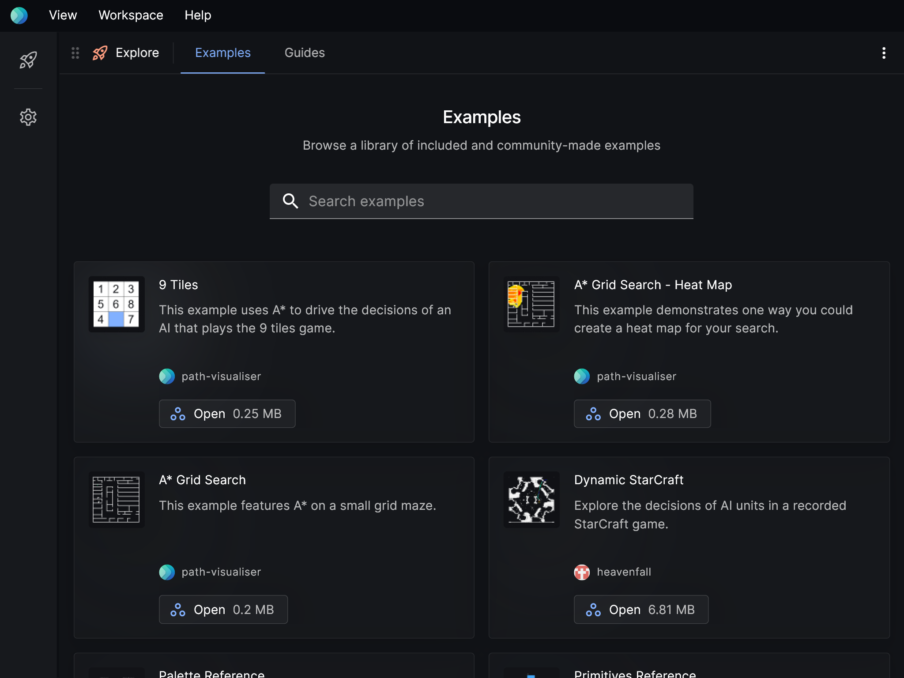

## Layers

Add, edit, and remove layers. The options available to a layer depends on the layer type.
[Read more about layers here.](./layers)

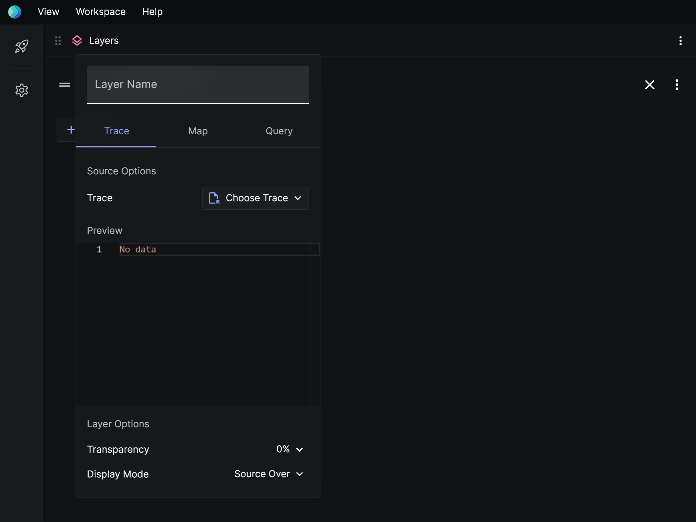

### General options

| Name         | Description                                                                                                                                                                                          |
| ------------ | ---------------------------------------------------------------------------------------------------------------------------------------------------------------------------------------------------- |
| Layer name   | A name for the layer. If empty, one will be auto-generated.                                                                                                                                          |
| Transparency | How see-through this layer will be in the viewport.                                                                                                                                                  |
| Display mode | How this layer will blend with its background in the viewport. [These are the options provided.](https://developer.mozilla.org/en-US/docs/Web/API/CanvasRenderingContext2D/globalCompositeOperation) |

### Trace options

Load a [search trace](./layers#trace) file.

| Name   | Description                                     |
| ------ | ----------------------------------------------- |
| Source | The search trace that gets drawn on this layer. |

### Map options

Load a [map](./layers#map).

| Name                | Description                                           |
| ------------------- | ----------------------------------------------------- |
| Map                 | The map that gets drawn on this layer.                |
| Tile color for "\*" | Grid maps only. The color to use for a specific tile. |

### Query options

Make a query using the [Visualiser Adapter Protocol](/docs/visualiser-adapter-protocol).

| Name | Description                            |
| ---- | -------------------------------------- |
| Map  | The map that gets drawn on this layer. |

## Events

Browse the events of a search trace.

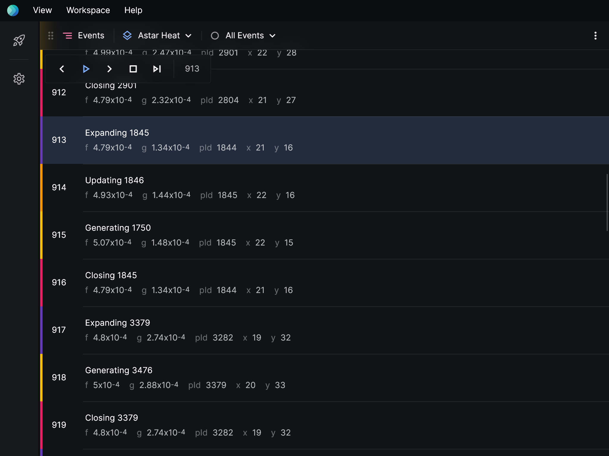

### Toolbar items

| Name       | Description                            | Default                      |
| ---------- | -------------------------------------- | ---------------------------- |
| Layer      | The layer to show events for.          | The first layer with events. |
| Event Type | Show only events that match this type. | Show all events.             |

## Viewport

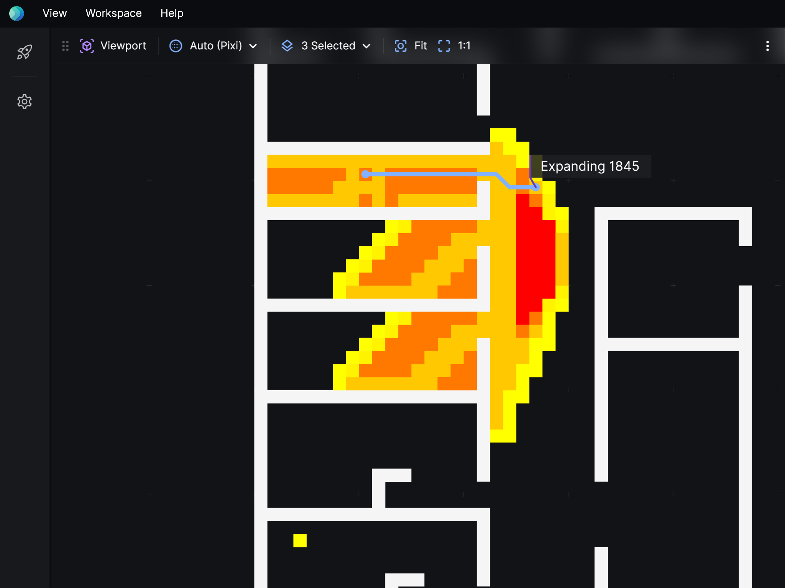

### Toolbar items

| Name     | Description                                                               | Default             |
| -------- | ------------------------------------------------------------------------- | ------------------- |
| Layers   | The layers to render.                                                     | Render all layers.  |
| Renderer | The renderer to use. [Read more about renderers.](./extensions#renderers) | Pick automatically. |

## Graph

Visualise search traces as decision trees.

For this to work, events in search traces must have `id` and `pId` properties. An `id` uniquely identifies a node in the search. `pId` is the parent node's `id`.

Since events with the same `id` might have multiple `pId`s, this makes it a directed graph rather than a tree, strictly speaking.

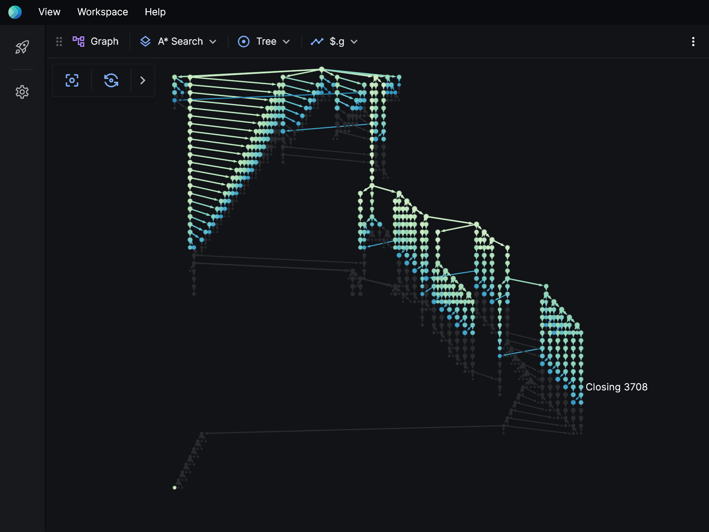

### Toolbar items

| Name             | Description                                                                                                                                                                                                                                                                                        | Default                        |
| ---------------- | -------------------------------------------------------------------------------------------------------------------------------------------------------------------------------------------------------------------------------------------------------------------------------------------------- | ------------------------------ |
| Layer            | The layer to draw a tree for.                                                                                                                                                                                                                                                                      | The first layer with events.   |
| Layout           | How the layout should be calculated. **Directed graph:** Organise the nodes, taking into account all associations, so that that overlapping edges a minimised. **Tree:** Organise the nodes such that if there's multiple parents for a single node, use only the one that appears last. | Show as a tree.                |
| Tracked property | Select a numeric property to use to render a heat scale.                                                                                                                                                                                                                                           | Off, use event colors instead. |

## Source

See the underlying files and data for each layer.

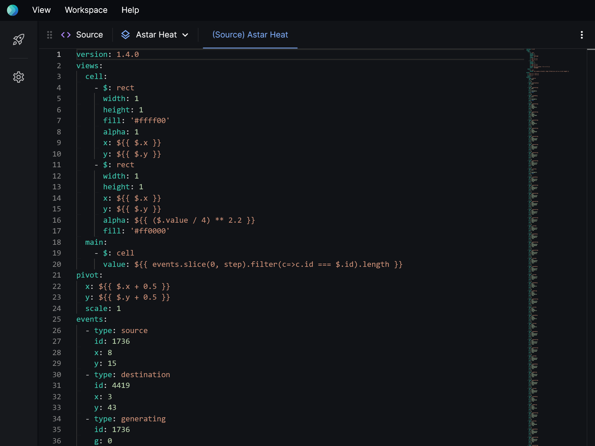

### Toolbar items

| Name  | Description                         | Default                            |
| ----- | ----------------------------------- | ---------------------------------- |
| Layer | The layer to show source files for. | The first layer with source files. |

## Debugger

Set breakpoints and points of interest.

### Standard debugger

Specify when playback should pause.

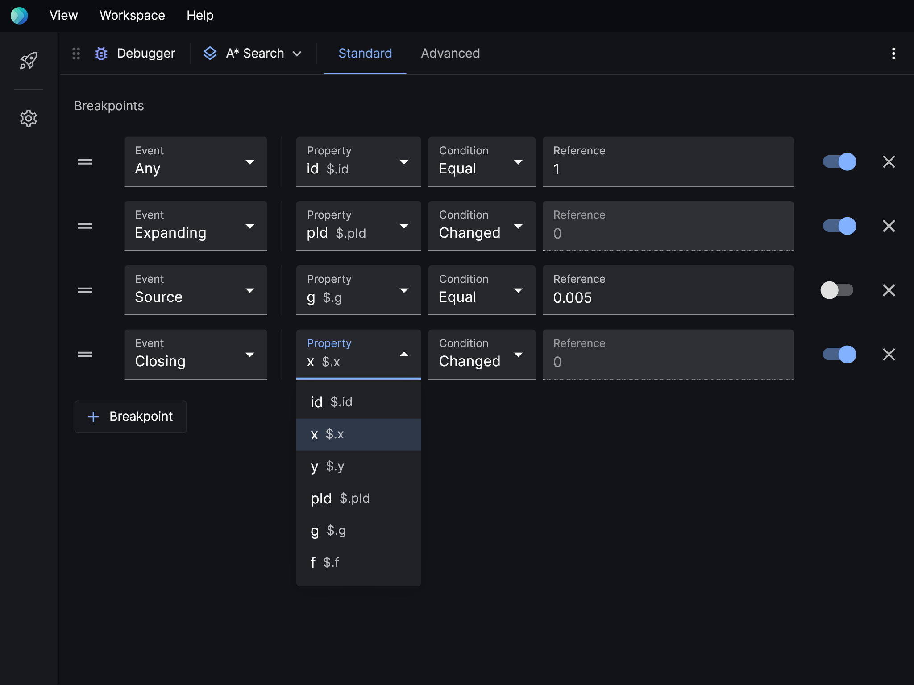

### Advanced debugger

Specify when playback should pause via a function. If `shouldBreak()` returns true, a breakpoint is added.

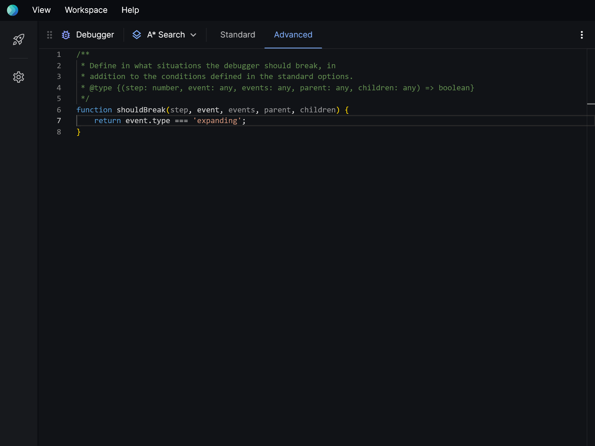

| Argument   | Description                     |
| ---------- | ------------------------------- |
| `step`     | `int` The current step.         |
| `event`    | `event` The current event.      |
| `events`   | `event[]` List of all events.   |
| `parent`   | `event` The parent event.       |
| `children` | `event[]` List of child events. |

### Toolbar items

| Name  | Description                       | Default                      |
| ----- | --------------------------------- | ---------------------------- |
| Layer | The layer to set breakpoints for. | The first layer with events. |

## Logs

Displays important messages and errors.

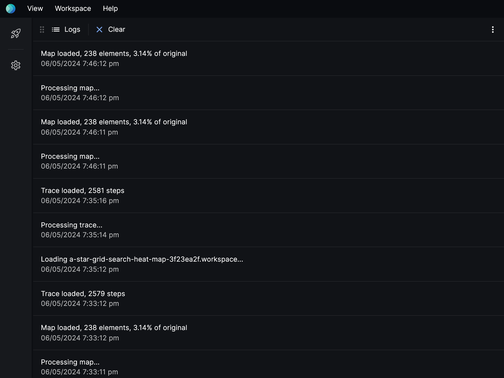

## Settings

Configure Posthoc.

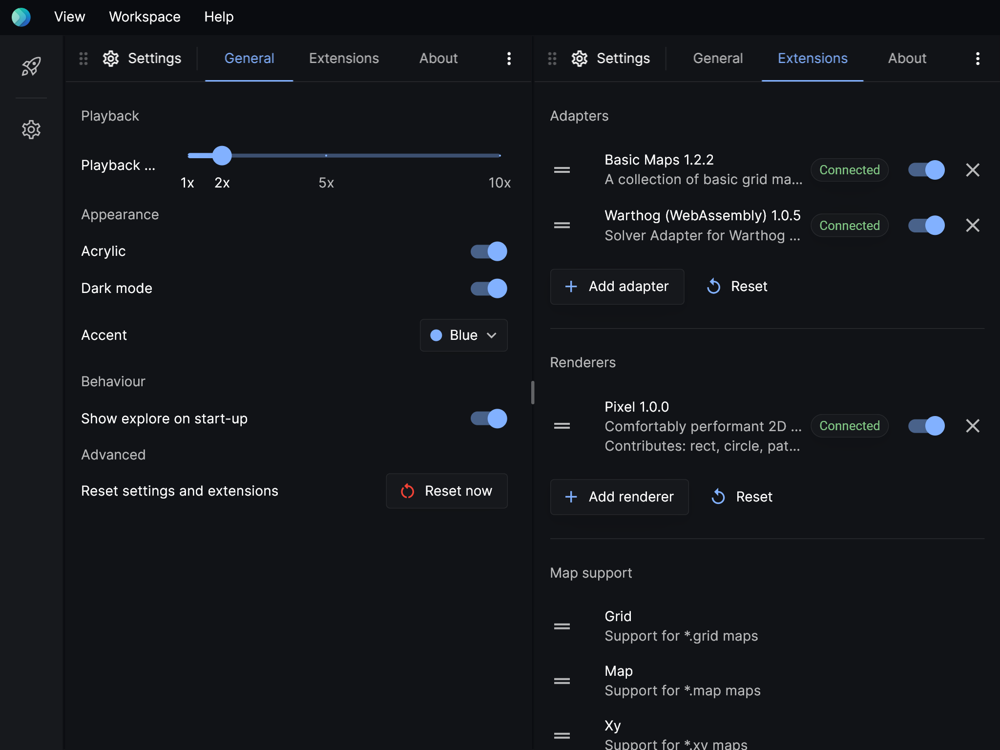

### General settings

| Setting                       | Description                                                                     |
| ----------------------------- | ------------------------------------------------------------------------------- |
| Playback rate                 | Set playback rate. 1x is 60 events per second.                                  |
| Acrylic                       | Use a subtle frosted glass effect. Turn this off for a small performance boost. |
| Dark mode                     | Whether the UI should use a dark colour palette.                                |
| Accent                        | Choose a theme color for Posthoc.                                               |
| Show explore on start-up      | Whether to show the Explore page when Posthoc is launched.                      |
| Reset settings and extensions | Completely reset Posthoc's settings and extensions.                             |

### Extensions

Manage connected solvers, adapters, renderers, and map parsers. [Read more about extensions here.](./extensions)

## Customising views

### Choosing content for a views

You can choose what content to display in views by clicking the dropdown menu on the top left.

### Add and remove views

You can find views controls in the extras menu on the top right. Add more panels by splitting existing menus horizontally or vertically.

You can also add a view using **View > Add panel to the right** and **View > Add panel below** in the title bar.

## Titlebar

The titlebar gives you commands that control Posthoc as a whole.

### View menu

| Item                   | Description                                                                                                                                                 |
| ---------------------- | ----------------------------------------------------------------------------------------------------------------------------------------------------------- |
| Add panel to the right | Create an empty view on the far right edge.                                                                                                                 |
| Add panel below        | Create an empty view on the bottom edge.                                                                                                                    |
| Reset layout           | Reset the panels to the original configuration. Depending on the screen size, this could be a vertical two-panel layout or a horizontal three-panel layout. |

### Workspace menu

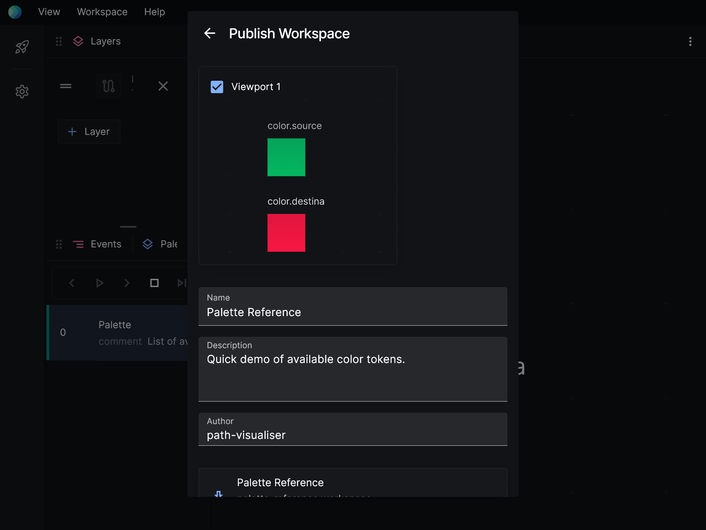

| Item             | Description                                                          |
| ---------------- | -------------------------------------------------------------------- |
| Open workspace   | Select a \*.workspace file to load.                                  |
| Add panel below  | Save the current project as a \*.workspace file.                     |
| Export workspace | Save the current project as a _.workspace and _.workspace.meta file. |

## Sidebar

The sidebar gives you quick access to Explore and Settings. In the future, you'll be able to pin items to the sidebar for quick access, and pop sidebar panels out into the main area.

## Drag and drop

You can import any supported file by dropping them into Posthoc.

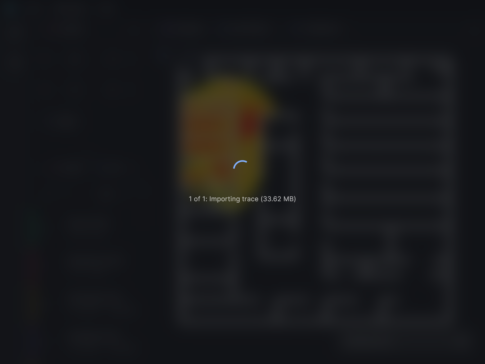
