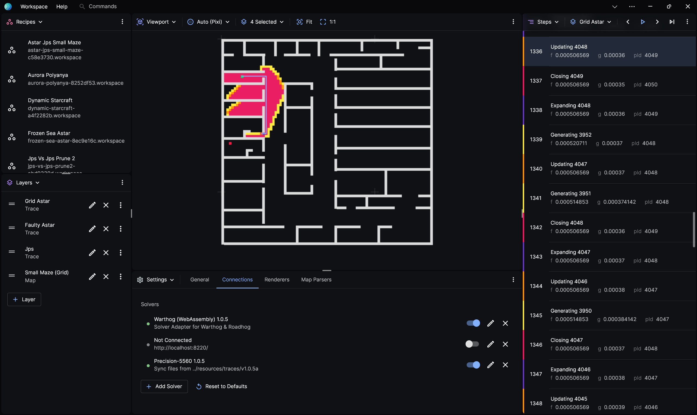
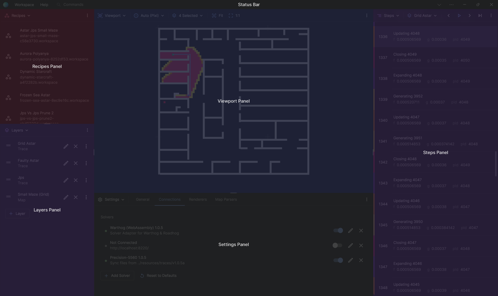
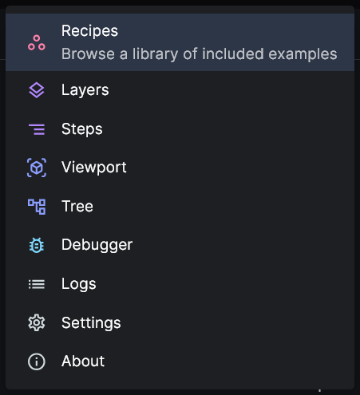
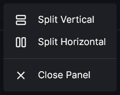

# User Interface

Posthoc's interface is made of composable panels. You can add, remove, and rearrange the UI to your desire. This allows Posthoc to support a range of tasks, whether you're using it to learn, showcase, or debug algorithms.

## Core Panels

When you first open Posthoc, it displays the following panels:

### Recipes

### Layers

Allows you to inspect and edit the layers that are currently being rendered.

[See more information on the Layers Panel](./layers).

### Viewport

Displays the visualisation.

[See more information on the Viewport Panel](./viewport).

### Steps

Displays the steps of the visualisation.

[See more information on the Steps Panel](./steps).

## Customising Panels

### Choosing Content for a Panel

You can choose what content to display in a panel by clicking the dropdown menu on the top left.

### Add and Remove Panels

You can find panel controls in the extras menu on the top right. Add more panels by splitting existing menus horizontally or vertically.

