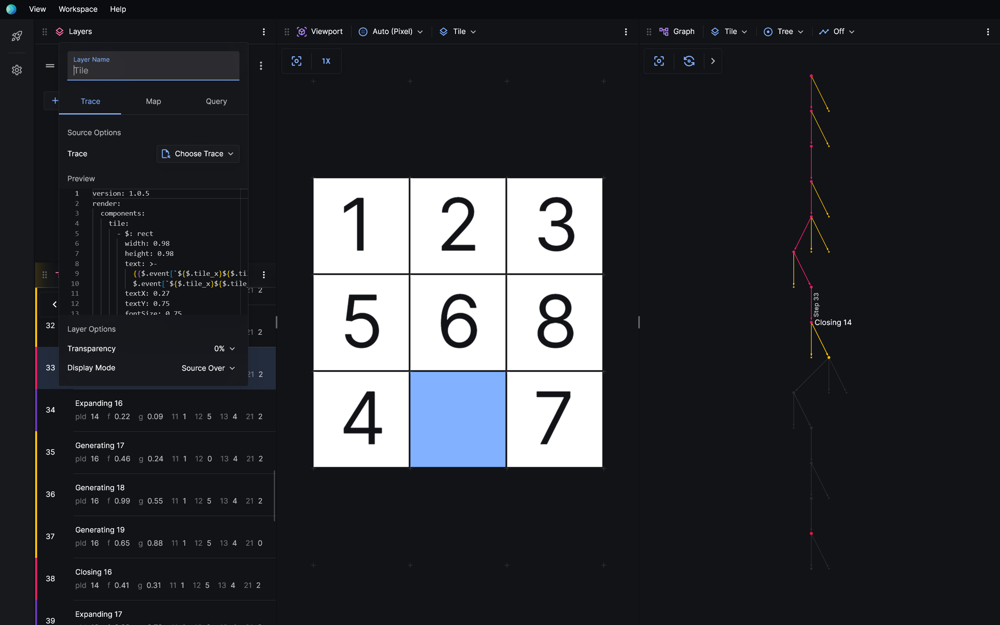
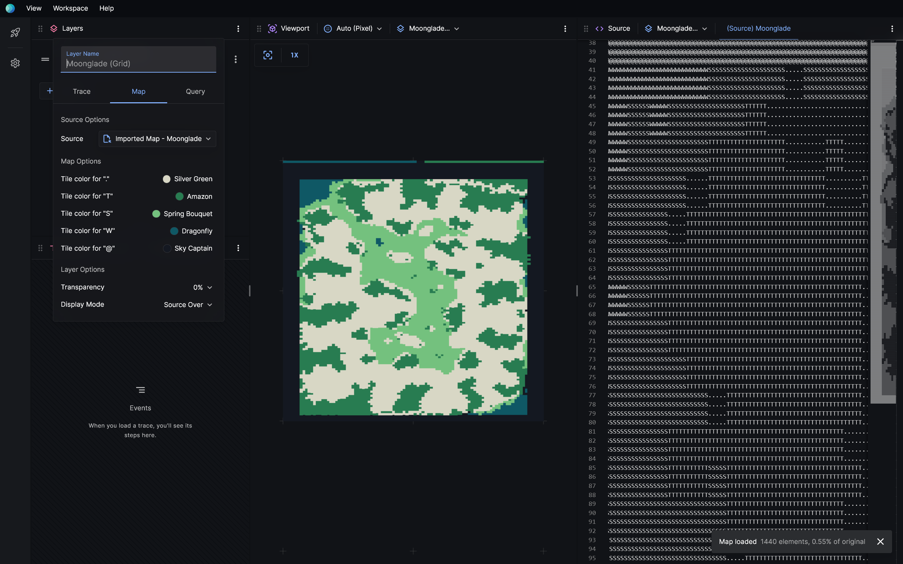
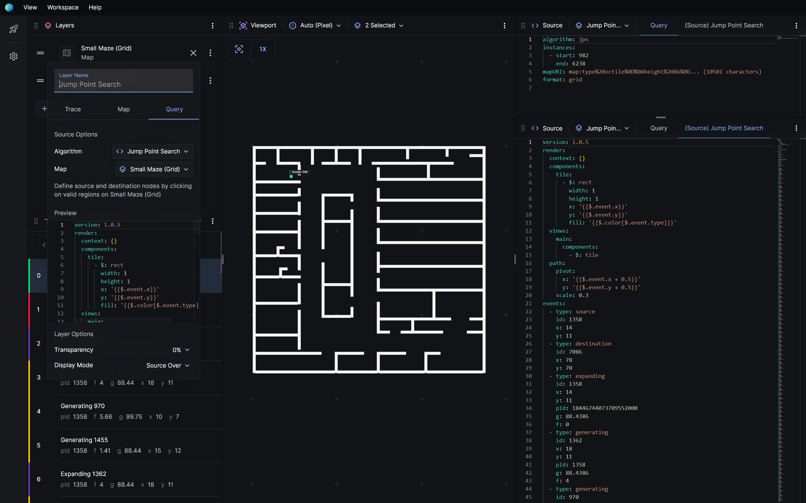

# Layers

Posthoc uses a layering system to help you create complex visualisations with tons of parts.

A lot of the time, you might want to overlay a search trace on top of a map. But you can stack as many search traces, maps, or queries on top of each other as you want.

## Layer type

Layers are designed as subsystems. They're independently responsible for accepting some input, processing it, and returning visualisable content to Posthoc, like what to draw, and what events there were.

Most views, like **graph**, **events**, and **debugger** needs you to choose a layer. They'll only allow you to choose layers with relevant content. For example, **events** would only allow you to choose **trace** and **query** layers because they contain a list of events.

### Trace

You can import a search trace file into a trace layer via **Trace > Choose Trace > Import Trace**. Search trace files have the extensions `*.trace.yaml` or `*.trace.json`. Some extensions may provide search traces directly, which appear below the **Import Trace** option.

When a search trace loads, you're given a quick preview of the file that was loaded.

Trace layers are supported by **event**, **viewport**, **graph**, **source**, and **debugger** views.

### Map

Maps are a separate list of filetypes that we thought deserved first-class support. Typically, these represent domains for pathfinding search, like grids, networks, and meshes.

It's optional to use maps because you might not be doing pathfinding search. We recommend you to use search traces for visualisation. But if you have files in a supported map format, it might be more convenient to use a map layer. You can import map files a map layer via **Source > Choose Map > Import Map**.

[Read about built-in map support here.](./extensions#map-support)

### Query

Query layers interact with extensions that implement the [visualiser adapter protocol](.). The query layer and the visualiser adapter protocol should allow you to interactively call your solver, complete with custom parameters and inputs.

We're yet to finalise this API. Currently, as proof-of-concept, the query layer allows you to run single-agent pathfinding problems on grid maps.

## Layer order

You can rearrange layers to change rendering order. Layers that are lower on the list are drawn over layers that are higher on the list.

## Layer mode

Layers can blend with existing layers in different ways. The default, **source over**, draws the current layer on top of existing layers. Layer modes like **multiply**, **difference**, **xor** can help you spot differences between search traces.

[A complete list of layer modes can be found here.](https://developer.mozilla.org/en-US/docs/Web/API/CanvasRenderingContext2D/globalCompositeOperation)
