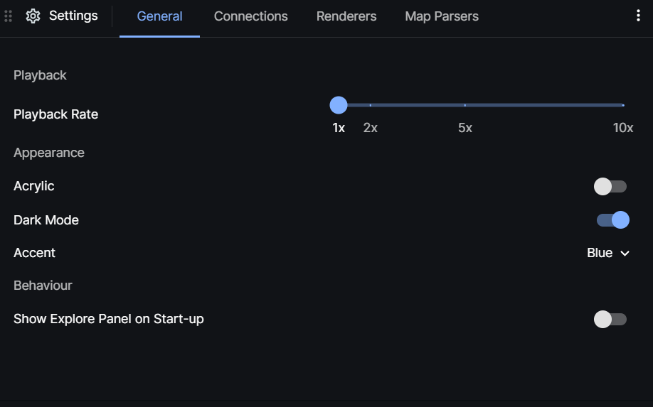

# Settings

Visualiser's setting panel gives the flexibillity to customise the web application.

## General

- To speed up the playback speed of the search trace within the view port, adjust the speed using the playback rate slider.
- To show the explore page at the start can be done within the page aswell by clickng the switch.

## Adding or Editing an Existing Solver

within the connections tab,

- To add a solver, click the + Add Solver button, this adds a new solver.
- To change the existing solver, press the edit (pencil) icon and add the URL and the connection type needed.

[TODO, more info on adding a solver and renderers]
