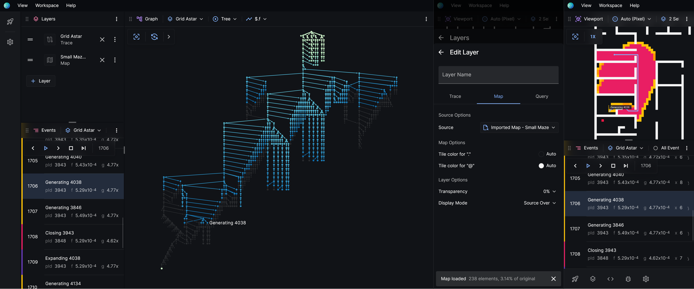

# Overview

Posthoc visualises [search traces](/docs/search-trace). It gives you a variety of
tools to help you analyse and debug your algorithm. It's quick to get started and
install-free &mdash; even better, it's robust and performant enough to support the
largest of problem instances.

## Get Posthoc

### Posthoc Web

You can use Posthoc directly in a browser.

[Open Posthoc](https://posthoc.pathfinding.ai)

### Posthoc PWA

Optionally, you can [install Posthoc as a web app](https://developer.mozilla.org/en-US/docs/Web/Progressive_web_apps/Guides/Installing) so that it runs in its own window. You can also install the Posthoc PWA on mobile devices.

### Standalone builds

Check the [releases](https://github.com/ShortestPathLab/posthoc-app/releases) page for a list of latest Windows and Linux releases. They work exactly the same as the web version, but you can get access to older versions of Posthoc.
