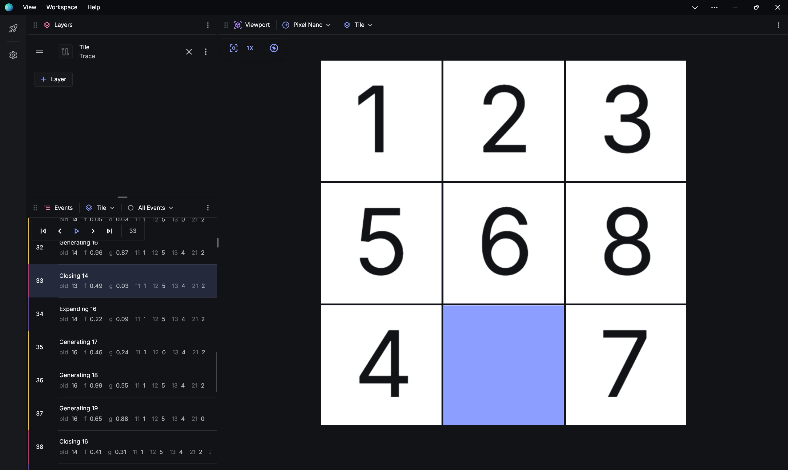
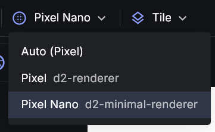

# Pixel Nano

**Pixel Nano** is a minimalist renderer. It works just like **Pixel**, except it runs on the main thread, doesn't support fancy features like tiling, dynamic resolution or infinite zoom, and doesn't scale as well for large problems.

However because there's much less overhead to run **Pixel Nano**, you might find that for smaller problems, it looks and performs better.

## Getting Pixel Nano

**Pixel Nano** is bundled with **Posthoc**, but not enabled by default.

To enable Pixel Nano, add [Pixel Nano's URL](/docs/visualiser/3-1-user-guide/extensions#built-in-renderers) to the Renderers list in [Posthoc's settings](/docs/visualiser/3-1-user-guide/interface#settings). Then, select **Pixel Nano** as the renderer for a viewport:

# API

## Primitives

**Pixel Nano** supports the same primitives as **Pixel**. [See here](/docs/visualiser/pixel-renderer#primitives).
