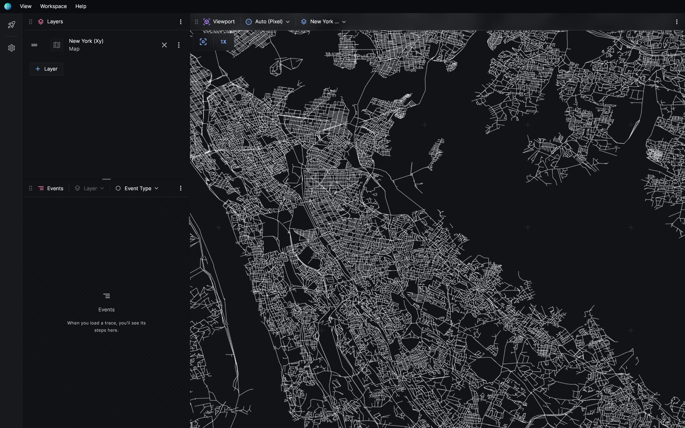
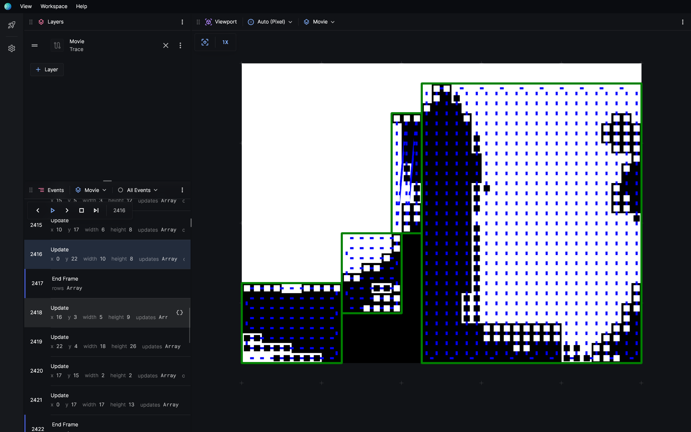

# Pixel renderer

**Pixel** is the 2D renderer that's built into Posthoc. It's designed for large-scale pathfinding search problems. It stays performant when there are millions of elements.

## Coordinate system

In **Pixel**, the `x` axis is horizontal, spanning left to right, and the `y` axis is vertical, spanning top to bottom. Lengths are measured in `px` units.

## Performance

**Pixel** uses multi-threaded, tile-based rendering with viewport culling. You can zoom in and out infinitely without loss in quality.
It also uses dynamic resolution, dropping the resolution down when the framerate decreases to help make playback smoother.

If you find that **Pixel** is starting to get laggy, here are some tips to improve rendering performance.

- **Turn off acrylic** The **Settings > General > Acrylic** option can decrease general UI performance. You can turn this off to make **Pixel** faster.
- **Combine elements** **Pixel**'s performance declines roughly linearly with the amount of elements. You can try to minimise the amount of elements by combining them. For example, draw a single large rectangle rather than several small rectangles.
- **Avoid text** Text rendering is considerably slower than shapes. Consider storing additional information in `$info` instead.

## API

### Primitives

#### `rect`

| Property     | Type                                                                       | Description                                                                                                                                                                         |
| ------------ | -------------------------------------------------------------------------- | ----------------------------------------------------------------------------------------------------------------------------------------------------------------------------------- |
| `x`          | `number` (px)                                                              | Required. Horizontal position of the top left corner of this rectangle.                                                                                                             |
| `y`          | `number` (px)                                                              | Required. Vertical position of the top left corner of this rectangle.                                                                                                               |
| `width`      | `number` (px)                                                              | Required. Width of this rectangle.                                                                                                                                                  |
| `height`     | `number` (px)                                                              | Required. Height of the rectangle.                                                                                                                                                  |
| `fill`       | [`CSSColor`](https://developer.mozilla.org/en-US/docs/Web/CSS/color_value) | Required. Color of this rect.                                                                                                                                                       |
| `alpha`      | `number` (0-1)                                                             | Opaqueness of this rect.                                                                                                                                                            |
| `label`      | `string`                                                                   | Display a label on top of this element. By default, its baseline left-aligned to the top left corner of the rectangle. The color of the label is determined by the `fill` property. |
| `label-x`    | `number` (px)                                                              | Offset the label by this amount horizontally.                                                                                                                                       |
| `label-y`    | `number` (px)                                                              | Offset the label by this amount vertically.                                                                                                                                         |
| `label-size` | `number` (px)                                                              | Required if a label is defined. The font size of the label. `1px` makes the label about `1px` tall.                                                                                 |

#### `circle`

| Property     | Type                                                                       | Description                                                                                                                                                             |
| ------------ | -------------------------------------------------------------------------- | ----------------------------------------------------------------------------------------------------------------------------------------------------------------------- |
| `x`          | `number`                                                                   | Required. The horizontal position of this circle's center.                                                                                                              |
| `y`          | `number`                                                                   | Required. The vertical position of this circle's center.                                                                                                                |
| `radius`     | `number`                                                                   | Required. The radius of this circle.                                                                                                                                    |
| `fill`       | [`CSSColor`](https://developer.mozilla.org/en-US/docs/Web/CSS/color_value) | Required. Color of this circle.                                                                                                                                         |
| `alpha`      | `number` (0-1)                                                             | Opaqueness of this circle.                                                                                                                                              |
| `label`      | `string`                                                                   | Display a label on top of this element. By default, its baseline left-aligned to the center of the circle. The color of the label is determined by the `fill` property. |
| `label-x`    | `number` (px)                                                              | Offset the label by this amount horizontally.                                                                                                                           |
| `label-y`    | `number` (px)                                                              | Offset the label by this amount vertically.                                                                                                                             |
| `label-size` | `number` (px)                                                              | Required if a label is defined. The font size of the label. `1px` makes the label about `1px` tall.                                                                     |

#### `path`

| Property     | Type                                                                       | Description                       |
| ------------ | -------------------------------------------------------------------------- | --------------------------------- |
| `points`     | `{ x: number, y: number }[]`                                               | Required. The points on the path. |
| `fill`       | [`CSSColor`](https://developer.mozilla.org/en-US/docs/Web/CSS/color_value) | Required. Color of this path.     |
| `line-width` | `number` (px)                                                              | The width of this path.           |
| `alpha`      | `number` (0-1)                                                             | Opaqueness of this path.          |

#### `polygon`

| Property | Type                                                                       | Description                           |
| -------- | -------------------------------------------------------------------------- | ------------------------------------- |
| `points` | `{ x: number, y: number }[]`                                               | Required. The points on this polygon. |
| `fill`   | [`CSSColor`](https://developer.mozilla.org/en-US/docs/Web/CSS/color_value) | Required. Color of this polygon.      |
| `alpha`  | `number` (0-1)                                                             | Opaqueness of this polygon.           |

### Pixel standalone

:::warning

This section is incomplete.

:::

You can use the **Pixel** renderer without **Posthoc**.
