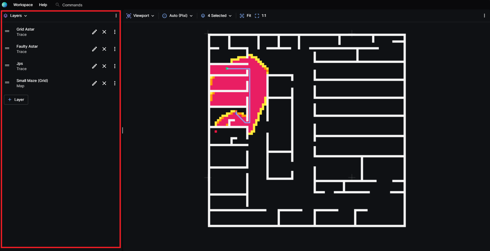
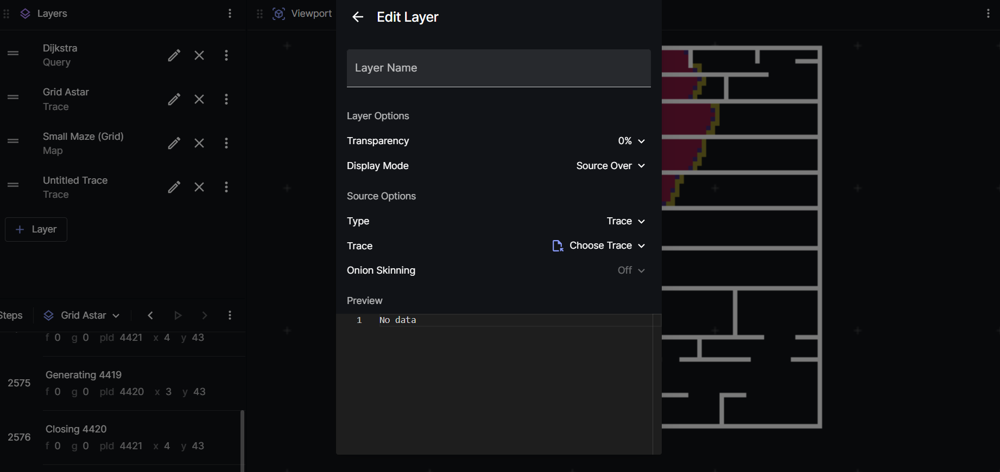

# Layers Panel

Visualiser's layers panel shows all layers that are present. Each layer could either be a [trace](../6-api/search-trace.md), [map, or query](../5-tutorials/single-agent-grid).

this is the layers panel.

## Adding a Layer 
- Click the + Layer button within the layers panel.
- A untitled Trace Layer will be added to the layers panel.

## Editing the Layer
- Click the edit (pencil) icon.
- A modal will come up like down below.

- Within this modal, there are options to change the layer it self such as the transperancy and the display mode.
- There is also an option to change the type of the layer. A more detailed example is available in the [single agent search tutorial](../5-tutorials/single-agent-grid.mdx)

## Other additional features
- To adjust the orders of the layers, drag the 2 stripes icon of the layer to the desired order, this affects on how the layers are shown within the viewport panel.
- To fit the layer to the viewport panel, click on the options (3 dots) on each individual layer and click on Fit Layer.

