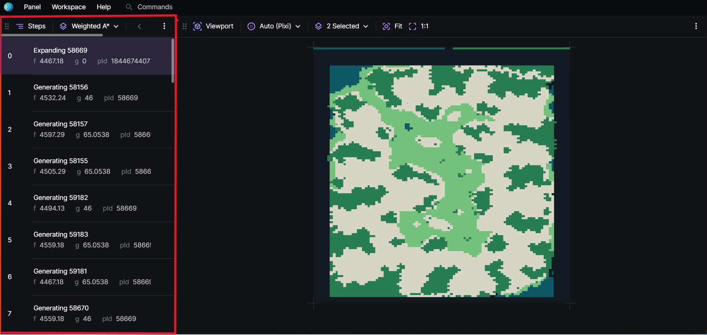
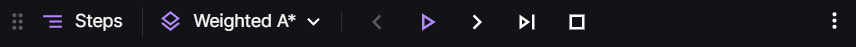
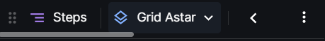

# Steps Panel

Visualiser's steps panel shows a list of steps of the current chosen trace.

## Navigating Through the Steps

- Dropdown: Changing the trace for the steps panel.
- Left and Right Arrows: move 1 step back and forward.
- Play: Play the search trace.
- Skip: Jump to the next breakpoint.
- Stop: Stops the playing trace.

## Other Additional Details

- Seeing each step info: Hover over the &#123; &#125; sign when hovering on a step.
- Unable to see the play button or the panel seems to be cut off ? There is a horizonatal scrollbar show the unseen part of the panel header.

  
