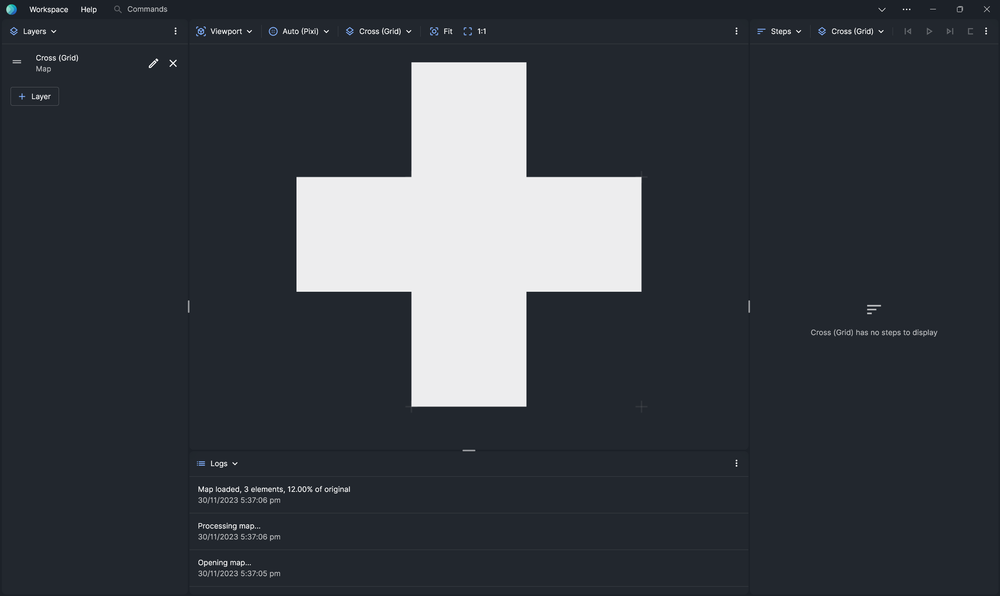
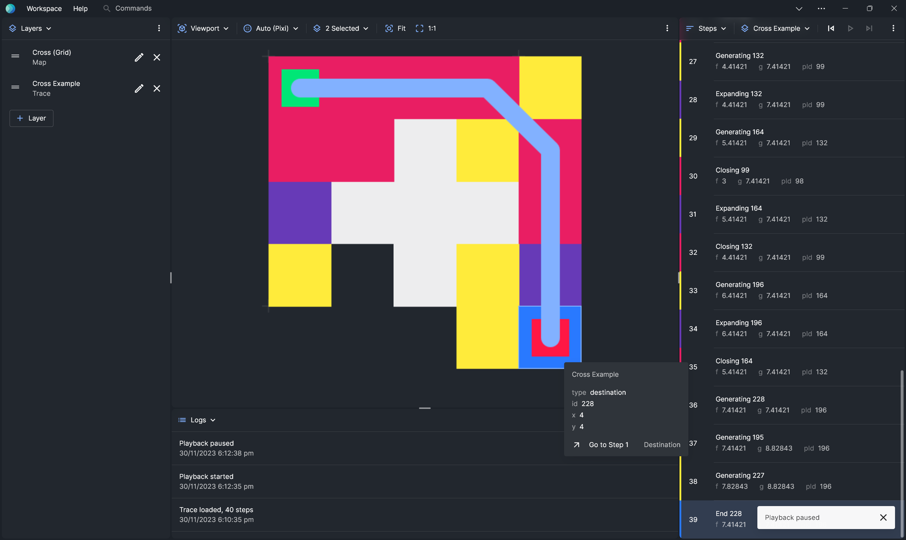

import Tabs from "@theme/Tabs";
import TabItem from "@theme/TabItem";

# A-Star Grid Search

Follow these steps to visualise a single-agent search, in our case A\*, on a grid map.

## Prepare the Map

We support grid maps as `.grid` files. A `.grid` file is a text file that looks like this:

```txt title="cross.grid"
type octile
height 5
width 5
map
.....
..@..
.@@@.
..@..
.....
```

Save this file as `cross.grid` to your system.

## Load the Map

- In the **Layer** panel, click **+ Layer** to add a new layer.
- Click the pencil icon to edit the layer.
- For **Type**, choose **Map**.
- For **Source**, choose **Import Map**, then pick `cross.grid` from your system.
- Close the **Edit Layer** modal.
- In the **Viewport** panel, click **Fit** to fit the map to the viewport.

This should be the result:



## Prepare the Search Trace

You can generate the search trace in a number of ways depending on your solver.

<Tabs>
  <TabItem value="raw" label="Demo Search Trace">
    Download [this](./cross-example.trace.yaml) pre-computed search trace.
  </TabItem>
  <TabItem value="warthog" label="Warthog">
    TODO.
  </TabItem>
</Tabs>

The file should start like this:

```yaml title="example.trace.yaml"
render:
  components:
    tile:
      - $: rect
        width: 1
        height: 1
        x: "{{$.event.x}}"
        y: "{{$.event.y}}"
        fill: "{{$.color[$.event.type]}}"
  views:
    main:
      components:
        - $: tile
  path:
    pivot:
      x: "{{$.event.x + 0.5}}"
      y: "{{$.event.y + 0.5}}"
    scale: 0.3
events:
  - type: source
    id: 96
    x: 0
    y: 0
  - type: destination
    id: 228
    x: 4
    y: 4
```

The search trace contains a record of the events that occured during the search and how to visualise them.

## Load the Search Trace

- In the **Layer** panel, click **+ Layer** to add a new layer.
- Click the pencil icon to edit the layer.
- For **Type**, choose **Trace**.
- For **Trace**, choose **Choose File**, then pick the search trace from your system.
- Close the **Edit Layer** modal.
- In the **Viewport** panel, click **Fit** to fit the map to the viewport.

## Step through the Search Trace

- In the **Steps** panel, choose the search trace layer from the layer dropdown. Here, the layer is named **Cross Example**.
- Click **Play**.



You have now visualised an A\* search on a grid map.
