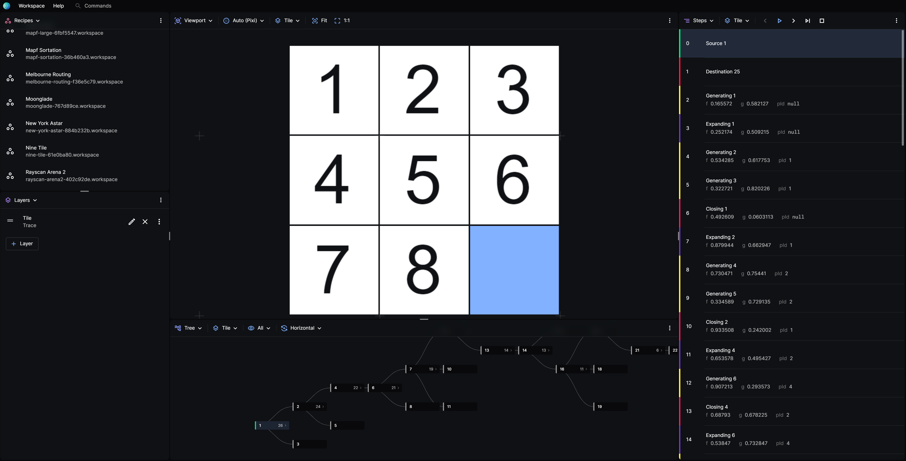
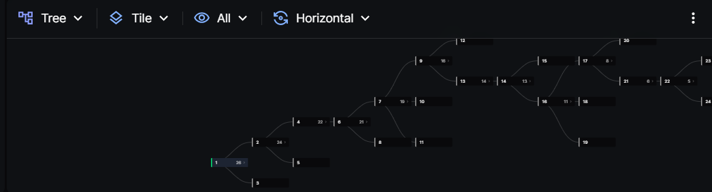

import Tabs from "@theme/Tabs";
import TabItem from "@theme/TabItem";
import LoadSearchTrace from "./_loading-search-trace.mdx";
import StepThroughSearchTrace from "./_step-through-the-search-trace.mdx";
import nineTileAndDecisionTree from "./nine-tile-and-decision-tree.png";

# Decision Tree

Posthoc comes with a built-in decision tree viewer for searches that may have no spatial embedding.

As an example, the A\* algorithm can be used to solve a nine-tile puzzle more efficiently than backtracking. Its heuristic would be how similar the current board state is to the final board state.

Follow these steps to visualise how an A\* search would play a nine-tile game, while seeing the decisions made along the way in a form of a tree using the built-in decision tree visualiser.



:::warning
This tutorial was written for version v1.1.9.
:::

## Prepare the Trace

Download [this](./tile.trace.yaml) pre-computed search trace.

    The file should start like this:

```yaml title="tile.trace.yaml"
version: 1.0.5

render:
  components:
    # this represents each tile
    tile:
      - # sets the shape of the tile into a rectangle
        $: rect

        # sets the height and width
        width: 0.98
        height: 0.98

        # sets if the tile context is 0 a.k.a empty, it will set the text into ''
        text: "{{$[`${$.tile_x}${$.tile_y}`] === 0 ? '' : $[`${$.tile_x}${$.tile_y}`]}}"

        # the text position within the tile
        textX: 0.27
        textY: 0.75

        # sets if the tile context is 0 a.k.a empty, it will not fill the tile
        fill: "{{$[`${$.tile_x}${$.tile_y}`] ? $.themeTextPrimary : $.themeAccent}}"

        # font settings
        fontSize: 0.75
        fontColor: "{{$.themeBackground}}"

        # sets the position of the tile within the board
        x: "{{$.tile_x}}"
        y: "{{$.tile_y}}"
        display: persistent

    # making a row of tiles
    tilerow:
      - $: tile
        tile_x: 1
      - $: tile
        tile_x: 2
      - $: tile
        tile_x: 3

    # making a board of rows
    tileboard:
      - $: tilerow
        tile_y: 1
      - $: tilerow
        tile_y: 2
      - $: tilerow
        tile_y: 3

  # sets the renderer as 2d-pixi and the tileboard as the component
  views:
    main:
      components:
        - $: tileboard

events:
  - # "11" represents the xy coordinate, 11 means the most top left tile
    # 1 represents the value of the tile, 1
    "11": 1
    "12": 4
    "13": 7
    "21": 2
    "22": 5
    "23": 8
    "31": 3
    "32": 6
    "33": 0
    id: 1
    type: "source"
  - "11": 1
    "12": 4
    "13": 6
    "21": 2
    "22": 5
    "23": 7
    "31": 3
    "32": 0
    "33": 8
    id: 25
    type: "destination"
```

The search trace contains a record of the events that occured during the search and how to visualise them.

## Load the Search Trace

<LoadSearchTrace />

## Step through the Search Trace

<StepThroughSearchTrace traceName="Tile" image={nineTileAndDecisionTree} />

## Viewing the Decision Tree

- On any panel, click the left-most dropdown and choose **Tree** to view the decision tree.
- A tree should show up as down below. By default, the tree only shows nodes that are related to the current node. To view all nodes, click on the third dropdown from the left and choose **All**.
- Explore the decisions by clicking through the nodes on the tree.



You have now visualised the decision tree of an A\* algorithm as it tries to solve a nine tile game.
